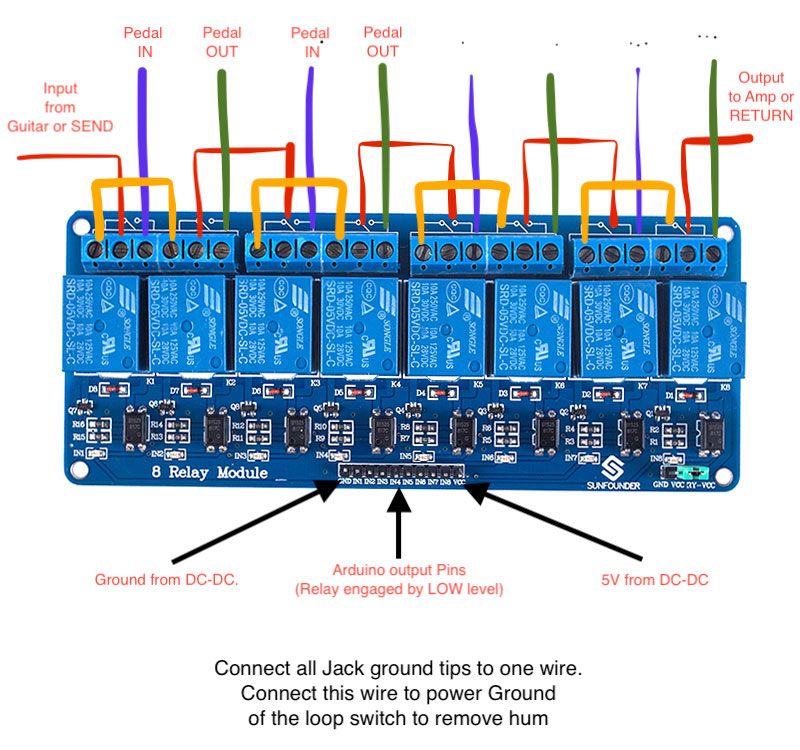
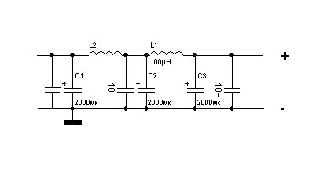

# Loop Switcher with MIDI Control

# Description

This device allows to control one(or both Amp pre/post loops) using MIDI Controller. 
Preset changing performed after receiving Program Change message, but can be modified for any type of message.
Also Schematic can be modified for using with monetary switch. Additional Array with control pins must be initiated and monitored in this case.

# Relays connection

Each relay power consumption is about 70mA, so use powerful and quality power adapter. Some of you could face some noises when FX engaged - check that you connected all grounds from all input jacks to the - of the power.

Additionaly, apply 2 filters to clean-up incoming power. Place one on the main after main power input beforre DC-DC converter and one after DC-DC converter. This will significaly improve total sound quality and reduce power bouncing.

Important:

  - MIDI listen requires to use Serial1(available in Arduino Mega) to avoid serial output issues. 
  - Use DC-DC converter to power up relays(5v required) as Arduinoi can work from pedal power supply.
  - For indication ILI9341 based display used.
  - For Switching loops 2 8-Relay Modules used
  

### Libraries

FX Switcher requiers 3rd party libs:

| Library | Link |
| ------ | ------ |
| GyverEncoder | https://github.com/AlexGyver/GyverLibs |
| MIDI Library | https://www.arduino.cc/reference/en/libraries/midi-library/ |

                                                          

Small shootout(in russian): https://youtu.be/fvrEu6rek-M
